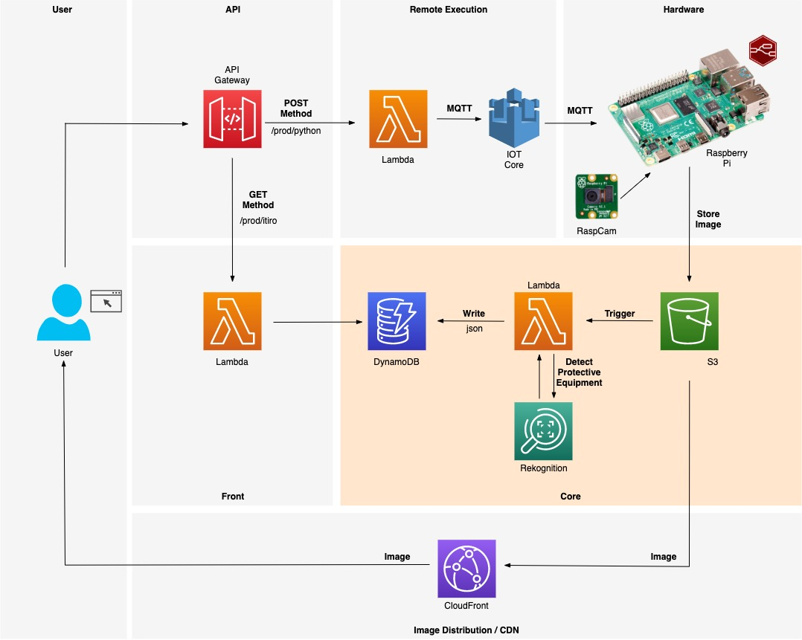

# CDK Python - Face Recognition

Under Construction!!!!



This is a project automated with AWS CDK (Python) and tested in AWS Cloud9 environment.

# How to create this solution on AWS:

Open the terminal on Cloud9 and clone this repo using git commands.
``` bash
git clone https://github.com/itirohidaka/facerecognition.git
```

To manually create a virtualenv on Linux. 
``` bash
cd ~/environment/facerecognition
python3 -m venv .venv
```

After the init process completes and the virtualenv is created, you can use the following
step to activate your virtualenv.
``` bash
source .venv/bin/activate
```

Once the virtualenv is activated, you can install the required dependencies.
``` bash
pip install -r requirements.txt
```

At this point you can now synthesize the CloudFormation template for this code.
``` bash
cdk synth
```
Deploy the solution on your AWS environment.
``` bash
cdk deploy
```
To add additional dependencies, for example other CDK libraries, just add
them to your `setup.py` file and rerun the `pip install -r requirements.txt`
command.

## Useful CDK commands

 * `cdk ls`          list all stacks in the app
 * `cdk synth`       emits the synthesized CloudFormation template
 * `cdk deploy`      deploy this stack to your default AWS account/region
 * `cdk diff`        compare deployed stack with current state
 * `cdk docs`        open CDK documentation

# Configuring the Raspberry Pi (Raspian)

To activate the Camera Pi use this commands:
``` bash
sudo apt-get update
sudo apt-get install python-picamera python3-picamera
```

Install the Node-Red on Raspian:
``` bash
bash <(curl -sL https://raw.githubusercontent.com/node-red/linux-installers/master/deb/update-nodejs-and-nodered)
```
To get more details on how to install Node-Red on Raspberry Pi click [here](https://nodered.org/docs/getting-started/raspberrypi).
